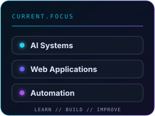
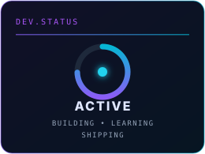
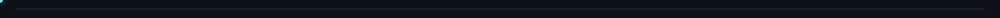

<!-- CYBERPUNK HEADER -->
<picture>
  <source media="(prefers-color-scheme: dark)" srcset="assets/banner-dark.svg" />
  <source media="(prefers-color-scheme: light)" srcset="assets/banner-light.svg" />
  
</picture>

I'm **Sahan Sandaruwan**, a passionate **Software Engineering Student @ SLIIT**,  
AI-focused learner, and a freelancer who loves building modern systems, trading crypto, and exploring intelligent solutions.

💡 *"Crafting logic, innovation, and digital mastery every day."*

---

<!-- CURRENT STREAK -->

  

  
  <picture>
    <source media="(prefers-color-scheme: dark)" srcset="https://github-readme-streak-stats-eight.vercel.app/?user=sahansbandara&theme=tokyonight&hide_border=true&background=0D1117&ring=8B5CF6&fire=06B6D4&currStreakLabel=06B6D4&sideLabels=A855F7" />
    
  </picture>
  

  

<!-- CONNECT -->

  

  
  
  
  
  
  

  
  

  

<!-- GITHUB STATISTICS -->

  

  <picture>
    <source media="(prefers-color-scheme: dark)" srcset="https://github-readme-stats-sigma-five.vercel.app/api?username=sahansbandara&show_icons=true&count_private=true&hide_border=true&bg_color=0D1117&title_color=8B5CF6&icon_color=06B6D4&text_color=E0E7FF" />
    
  </picture>
  <picture>
    <source media="(prefers-color-scheme: dark)" srcset="https://github-readme-stats-sigma-five.vercel.app/api/top-langs/?username=sahansbandara&layout=compact&langs_count=8&hide_border=true&bg_color=0D1117&title_color=8B5CF6&text_color=E0E7FF" />
    
  </picture>

  

<!-- CODING ACTIVITY -->

  

  <picture>
    <source media="(prefers-color-scheme: dark)" srcset="https://github-readme-activity-graph.vercel.app/graph?username=sahansbandara&bg_color=0D1117&color=E0E7FF&line=8B5CF6&point=06B6D4&area=true&area_color=8B5CF6&hide_border=true" />
    
  </picture>

  

  

  

  <b>TypeScript · React · Next.js · Node.js · Python · .NET · MongoDB · Docker · Kubernetes · MySQL</b>

  

<!-- FEATURED PROJECTS -->

  

<table>
  <tr>
    <td width="50%" valign="top">
      <h3><a href="https://github.com/sahansbandara/Yatara-Ceylon">Yatara Ceylon</a> · <a href="https://www.yataraceylon.me/">🌐 Live Site</a></h3>
      
Tourism operations and booking platform with dashboards, payments, fleet coordination, and finance management.

      
<code>TypeScript</code> <code>Next.js</code> <code>React</code> <code>MongoDB</code>

    </td>
    <td width="50%" valign="top">
      <h3><a href="https://github.com/sahansbandara/healthlab-crowdsource">HealthLab Crowdsource</a></h3>
      
AI-assisted digital health research platform covering participants, moderation, analytics, and funding workflows.

      
<code>React</code> <code>Node.js</code> <code>MongoDB</code> <code>Gemini/Groq</code>

    </td>
  </tr>
  <tr>
    <td width="50%" valign="top">
      <h3><a href="https://github.com/sahansbandara/Advanced-TradingView-Indicator">Advanced TradingView Indicator</a></h3>
      
Multi-signal market analysis indicator with SMC, divergences, order blocks, liquidity zones, and alerts.

      
<code>Pine Script</code> <code>TradingView</code> <code>Technical Analysis</code>

    </td>
    <td width="50%" valign="top">
      <h3><a href="https://github.com/sahansbandara/sl-vehicle-intern-tracker">Vehicle &amp; Intern Tracker</a></h3>
      
Monitors 25+ Sri Lankan vehicle, dealer, news, and internship sources and sends categorized Telegram alerts.

      
<code>Node.js</code> <code>Apify</code> <code>Cheerio</code> <code>Docker</code>

    </td>
  </tr>
  <tr>
    <td width="50%" valign="top">
      <h3><a href="https://github.com/sahansbandara/FlickSL-Telegram-Bot">FlickSL</a> · <a href="https://app.imsahans.online/">🌐 Live Site</a></h3>
      
Telegram-first movie and series platform with search, subtitles, Mini App profiles, and secure file delivery.

      
<code>Python</code> <code>Hydrogram</code> <code>MongoDB</code> <code>aiohttp</code>

    </td>
    <td width="50%" valign="top">
      <h3><a href="https://github.com/sahansbandara/React-X-Boss">React X Boss</a></h3>
      
Channel engagement automation for reactions, poll voting, session orchestration, view workflows, and analytics.

      
<code>Python</code> <code>Aiogram</code> <code>Pyrogram</code> <code>MongoDB</code>

    </td>
  </tr>
  <tr>
    <td width="50%" valign="top">
      <h3><a href="https://github.com/sahansbandara/Toxic-Comment-NLP-AIML-Project">Toxic Comment NLP</a></h3>
      
Modular machine-learning pipeline for toxic comment preprocessing, classification, evaluation, and inference.

      
<code>Python</code> <code>NLP</code> <code>Scikit-learn</code> <code>Machine Learning</code>

    </td>
    <td width="50%" valign="top">
      <h3><a href="https://github.com/sahansbandara/Laundry-Management-System-WEB">SmartFold</a></h3>
      
Full-stack laundry operations platform for orders, payments, inventory, staff tasks, and delivery tracking.

      
<code>Spring Boot</code> <code>Java</code> <code>MySQL</code> <code>JavaScript</code>

    </td>
  </tr>
</table>

  

<!-- TOOLS -->

  

  

  <b>VS Code · Git · GitHub · Linux · Postman · Figma · Vercel · Azure</b>

  

<!-- CONTRIBUTIONS -->

  

  <picture>
    <source media="(prefers-color-scheme: dark)" srcset="https://raw.githubusercontent.com/sahansbandara/sahansbandara/output/github-contribution-grid-snake-dark.svg" />
    
  </picture>

<!-- CYBERPUNK FOOTER -->
<picture>
  <source media="(prefers-color-scheme: dark)" srcset="assets/footer-dark.svg" />
  <source media="(prefers-color-scheme: light)" srcset="assets/footer-light.svg" />
  
</picture>
