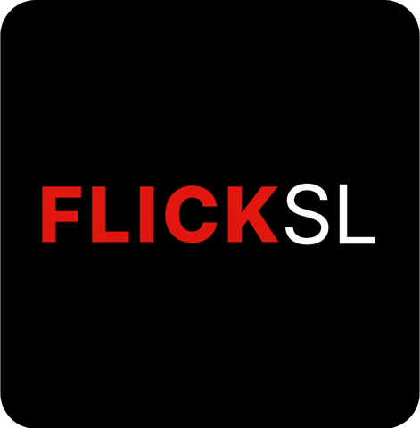
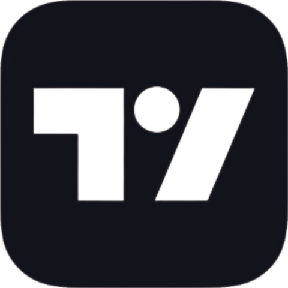

<picture>
  <source media="(prefers-color-scheme: dark)" srcset="assets/banner-dark.svg" />
  <source media="(prefers-color-scheme: light)" srcset="assets/banner-light.svg" />
  
</picture>

# Sahan Sandaruwan

Software Engineering student building full-stack products, AI-enabled systems, and practical automation.

## About Me

Software Engineering student at SLIIT.

I build web platforms, workflow automation, and data-driven applications.

Current focus: AI systems, automation, and reliable full-stack engineering.

## Contact and Links

- Portfolio: not currently listed
- [LinkedIn](https://www.linkedin.com/in/imsahans)
- [Email](mailto:Sahansbandara.mail@gmail.com) · [Telegram](https://t.me/ImSahans) · [GitHub](https://github.com/sahansbandara)

## Featured Projects

<table>
  <tr>
    <td width="50%" valign="top">
      
      <h3><a href="https://github.com/sahansbandara/Yatara-Ceylon">Yatara Ceylon</a></h3>
      
Tourism operations and booking platform with role-based dashboards, payments, fleet coordination, and finance management.

      
<b>Stack:</b> TypeScript, Next.js, MongoDB

      
<a href="https://github.com/sahansbandara/Yatara-Ceylon">Repository</a> · <a href="https://www.yataraceylon.me/">Live demo</a>

    </td>
    <td width="50%" valign="top">
      
      <h3><a href="https://github.com/sahansbandara/healthlab-crowdsource">HealthLab Crowdsource</a></h3>
      
Health-research platform for participant workflows, experiment management, moderation, analytics, and funding support.

      
<b>Stack:</b> React, Node.js, MongoDB

      
<a href="https://github.com/sahansbandara/healthlab-crowdsource">Repository</a>

    </td>
  </tr>
  <tr>
    <td width="50%" valign="top">
      
      <h3>FlickSL</h3>
      
Telegram-first movie and series platform with metadata, subtitles, Mini App profiles, and secure file delivery.

      
<b>Stack:</b> Python, Hydrogram, MongoDB

      
Repository currently unavailable · <a href="https://app.imsahans.online/">Live demo</a>

    </td>
    <td width="50%" valign="top">
      
      <h3><a href="https://github.com/sahansbandara/Advanced-TradingView-Indicator">Advanced TradingView Indicator</a></h3>
      
Market-analysis indicator combining SMC, divergences, order blocks, liquidity zones, moving averages, and alerts.

      
<b>Stack:</b> Pine Script, TradingView, SMC

      
<a href="https://github.com/sahansbandara/Advanced-TradingView-Indicator">Repository</a>

    </td>
  </tr>
</table>

## More Projects

| Project | Purpose | Stack | Repository |
| --- | --- | --- | --- |
| Vehicle & Intern Tracker | Monitors Sri Lankan vehicle, dealer, news, and internship sources and sends categorized Telegram alerts. | Node.js, Apify, Docker | [Repository](https://github.com/sahansbandara/sl-vehicle-intern-tracker) |
| React X Boss | Channel engagement automation for reactions, polls, approvals, view workflows, and analytics. | Python, Aiogram, MongoDB | Unavailable |
| Toxic Comment NLP | NLP pipeline for text preprocessing, feature extraction, model training, evaluation, and inference. | Python, NLP, scikit-learn | [Repository](https://github.com/sahansbandara/ToxicNLP-Part-Separation) |
| SmartFold | Role-based laundry operations system for orders, payments, inventory, tasks, delivery tracking, and notifications. | Java, Spring Boot, MySQL | [Repository](https://github.com/sahansbandara/Laundry-Management-System-WEB) |

## Technical Skills

| Area | Technologies |
| --- | --- |
| Languages | TypeScript, JavaScript, Python, Java, PHP, Pine Script, Bash |
| Frontend | React, Next.js, React Native, Redux, Tailwind CSS, Material UI, HTML, CSS |
| Backend | Node.js, Express, NestJS, Spring Boot, Laravel, Flask, .NET |
| Databases | MongoDB, MySQL, PostgreSQL, Redis, Firebase |
| DevOps and Cloud | Docker, Kubernetes, AWS, Nginx, Terraform, Jenkins, GitHub Actions, Linux |
| Tools | Git, GitHub, Postman, VS Code, IntelliJ IDEA, Figma, Grafana |

## Current Focus

Building AI-enabled systems, automation workflows, and full-stack applications with maintainable engineering foundations.

## GitHub Activity

  
  

## Let’s Collaborate

Open to thoughtful collaboration on full-stack products, AI systems, and automation projects. Reach out by [email](mailto:Sahansbandara.mail@gmail.com) or [LinkedIn](https://www.linkedin.com/in/imsahans).

<picture>
  <source media="(prefers-color-scheme: dark)" srcset="assets/footer-dark.svg" />
  <source media="(prefers-color-scheme: light)" srcset="assets/footer-light.svg" />
  
</picture>
