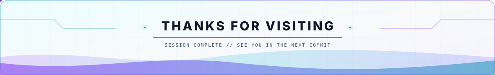

<!-- 🌌 CYBERPUNK HEADER -->
<picture>
  <source media="(prefers-color-scheme: dark)" srcset="assets/banner-dark.svg" />
  <source media="(prefers-color-scheme: light)" srcset="assets/banner-light.svg" />
  
</picture>

I'm **Sahan Sandaruwan**, a passionate **Software Engineering Student @ SLIIT**,  
AI-focused learner, and a freelancer who loves building modern systems, trading crypto, and exploring intelligent solutions.

💡 *"Crafting logic, innovation, and digital mastery every day."*

---

## Current Streak

  <picture>
    <source media="(prefers-color-scheme: dark)" srcset="https://github-readme-streak-stats-eight.vercel.app/?user=sahansbandara&theme=tokyonight&hide_border=true&background=0D1117&ring=8B5CF6&fire=06B6D4&currStreakLabel=06B6D4&sideLabels=A855F7" />
    
  </picture>

---

## Connect With Me

  
  
  
  

  
  

---

## GitHub Statistics

  <picture>
    <source media="(prefers-color-scheme: dark)" srcset="https://github-readme-stats-sigma-five.vercel.app/api?username=sahansbandara&show_icons=true&count_private=true&hide_border=true&bg_color=0D1117&title_color=8B5CF6&icon_color=06B6D4&text_color=E0E7FF" />
    
  </picture>
  <picture>
    <source media="(prefers-color-scheme: dark)" srcset="https://github-readme-stats-sigma-five.vercel.app/api/top-langs/?username=sahansbandara&layout=compact&langs_count=8&hide_border=true&bg_color=0D1117&title_color=8B5CF6&text_color=E0E7FF" />
    
  </picture>

---

## Coding Activity

  <picture>
    <source media="(prefers-color-scheme: dark)" srcset="https://github-readme-activity-graph.vercel.app/graph?username=sahansbandara&bg_color=0D1117&color=E0E7FF&line=8B5CF6&point=06B6D4&area=true&area_color=8B5CF6&hide_border=true" />
    
  </picture>

---

## Skills

  

---

## GitHub Trophies

  

---

## Tools

  

---

## My Contributions

  <picture>
    <source media="(prefers-color-scheme: dark)" srcset="https://raw.githubusercontent.com/sahansbandara/sahansbandara/output/github-contribution-grid-snake-dark.svg" />
    
  </picture>

<!-- 🌌 CYBERPUNK FOOTER -->
<picture>
  <source media="(prefers-color-scheme: dark)" srcset="assets/footer-dark.svg" />
  <source media="(prefers-color-scheme: light)" srcset="assets/footer-light.svg" />
  
</picture>
